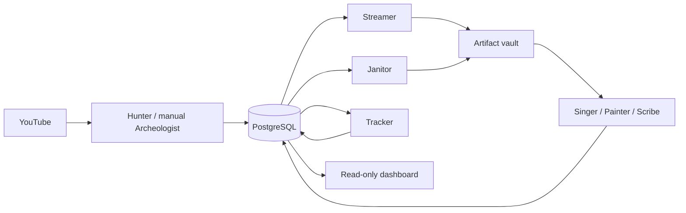

# Architecture

`atlas` owns persistence and network/storage infrastructure. SQL lives in
`atlas.repositories`. `maia` contains stateless operations and one scheduler.
The optional MCP server serves on-demand client requests independently.

`maia.orchestrator` schedules nine plain async operations: Streamer, Singer,
Painter, Scribe, Hunter, Tracker, Heartbeat, Janitor, and Topics. A failed cycle is logged
and isolated; other loops continue. Initial jitter spreads startup work.
Signals drain the scheduler according to the
[contract](implementation-checklists/orchestrator-contract.md).
Prefect flow adapters remain for rollback/compatibility, without owning cadence.

Hunter acknowledges a discovery page after database persistence succeeds.
Streamer fetches source media once into the vault. Singer and Painter derive
audio/keyframes from it; Scribe prefers captions and may use bounded paid audio
transcription. Scribe stages transcript JSON in PostgreSQL. Janitor owns batched
transcript vault writes and finalization. Full clips and historical discovery
are manual capabilities.

A video's lifecycle status and individual `raw/audio/visuals/transcript/clip`
phases describe different facts. Failed stages do not imply every other stage
failed. Boolean artifact flags remain synchronized by the source schema's
trigger; archived hot flags can be cleared while artifacts remain in the vault.

Tracker uses the durable watchlist, not the hot extraction queue. Last-sample
metrics and next due time survive archival. Janitor handles retention only after
vault safety checks. See [storage](tiered-storage.md) and
[adaptive tracking](adaptive-scheduling.md).

The dashboard reads bounded repository queries with a separate read-only pool.
It neither invokes agents nor consumes YouTube/Hugging Face quota. Systemd status
and persisted events are labeled separately; an event is not proof that every
agent is healthy.

The topic backfill uses owned, expiring leases. Durable leases for the extraction
stages and further schema normalization remain reviewed future work; row locks
alone do not provide ownership after a transaction commits. Cleanup never applies
schema changes to the live database. See the [current audit](audits/OCTOBER_CLEANUP.md).

The reusable [tiered storage library](../tiered_storage/README.md) has no runtime dependencies.
Atlas adapts its verified handoff engine to PostgreSQL and the vault; Maia owns cadence.
See [storage](tiered-storage.md) for immutable paths, retained-payload reconciliation, and row-version guards.

The [topic graph](knowledge-graph.md) uses normalized Wikipedia classifications
from the Data API, with bounded background enrichment and read-only exploration.
